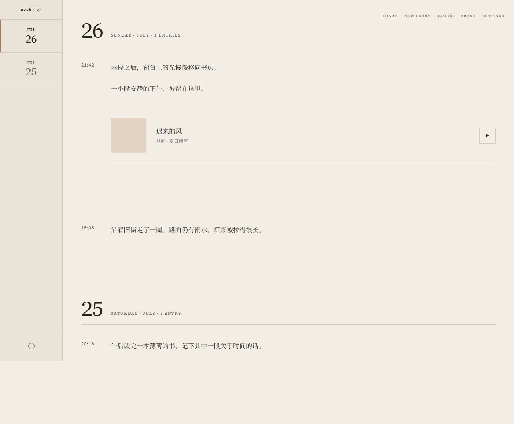
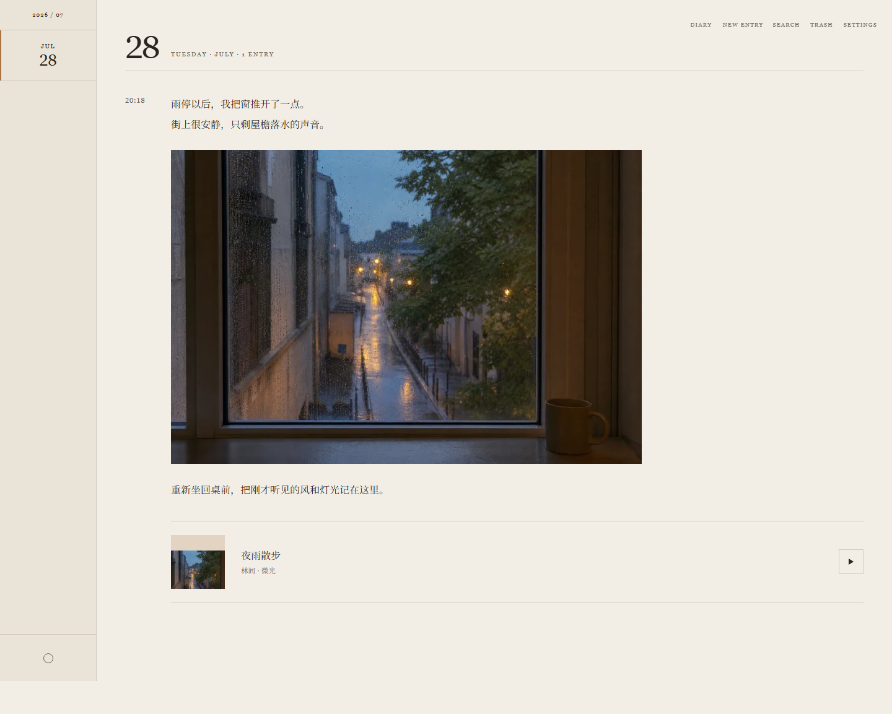

# Local Diary

一个面向 Windows PC 的本地优先日记应用。

每天可以写多条记录。每条记录包含必填标题与正文，并可插入多张图片、附加一首 MP3。应用会读取歌曲文件中的标题、歌手、专辑、年份与封面，也可以继续在线识别或由用户手动修正。

所有日记、图片和音乐默认保存在本机；阅读、编辑、搜索、播放、备份和导出均可离线完成。



> 当前版本：`0.1.0`  
> 支持平台：Windows x64  
> 当前安装包尚未进行 Authenticode 代码签名，Windows SmartScreen 可能显示提醒。

## 功能

- 同一天可发布多条日记，按北京时间精确到分钟。
- 标题仅用于编辑、搜索和索引，不会出现在阅读正文首行。
- 连续时间线阅读，可直接滚动跨天查看。
- 左侧日期栏只显示有记录的日期；点击日期后，该日贴到窗口顶部。
- 左上角日历只允许点击有记录的日期，并跟随当前滚动位置自动切换月份。
- Markdown 正文编辑与预览；普通换行会按原样显示。
- 一条日记可插入多张图片，原图会保留，同时生成阅读图与缩略图。
- 一条日记可附加一首 MP3，支持本地持续播放和浮动播放器。
- 自动读取 MP3 内嵌的歌名、歌手、专辑、年份和封面。
- 元数据不完整时可继续在线匹配或进行音频指纹识别；所有字段和封面均可手动修改。
- 标题、正文、标签、歌名、歌手和专辑统一搜索。
- 浅色、深色和跟随系统三种主题状态，一个圆形按钮循环切换。
- 已发布日记可以修改，但原始发布时间不会改变。
- 删除的日记进入回收站，30 天内可以恢复。
- 每日增量备份，保留最近 30 个逻辑快照。
- 支持完整归档导出、完整归档恢复和便携 Markdown 导出。
- 同时提供桌面窗口模式与浏览器模式；两种模式使用同一份本地数据。

## 一条完整日记示例

下面的记录完全为演示内容，不包含真实用户数据。它同时包含多行文字、一张正文图片和一首音乐：

```markdown
雨停以后，我把窗推开了一点。
街上很安静，只剩屋檐落水的声音。


重新坐回桌前，把刚才听见的风和灯光记在这里。
```

附加音乐：

| 字段 | 示例 |
|---|---|
| 文件 | `night-rain.mp3` |
| 歌名 | 夜雨散步 |
| 歌手 | 林间 |
| 专辑 | 微光 |
| 年份 | 2026 |

应用中的最终效果：



示例照片为生成的虚构素材，可在 [docs/images/example-rain-window.webp](docs/images/example-rain-window.webp) 查看原图。

## 安装

### 从 GitHub Releases 安装

1. 打开仓库的 **Releases** 页面。
2. 下载 `Local-Diary-Setup-0.1.0-x64.exe`。
3. 如需验证文件，在同一版本的 `checksums.sha256` 中找到安装包的 SHA-256，然后在 PowerShell 执行：

   ```powershell
   Get-FileHash -Algorithm SHA256 .\Local-Diary-Setup-0.1.0-x64.exe
   ```

4. 双击安装包。
5. 如果 SmartScreen 阻止运行，确认文件来源和 SHA-256 后，选择“更多信息”并继续运行。
6. 选择安装目录并完成安装。

安装器会创建两种入口：

- **Local Diary**：在独立桌面窗口中打开。
- **Local Diary - Browser**：启动同一个本地服务，并在默认浏览器中打开。

桌面与开始菜单中都会创建对应快捷方式。两种入口共享数据，同时启动时也只会保留一个本地服务实例。

## 使用方法

### 1. 新建日记

1. 点击页面右上角的 `NEW ENTRY`。
2. 在 `TITLE` 中输入标题。标题必填，但只作为索引使用。
3. 在 `MARKDOWN` 中输入正文。正文必填。
4. 编辑过程中草稿会在后台自动保存；程序意外关闭后，再次点击 `NEW ENTRY` 会恢复未完成草稿。
5. 点击 `DONE` 发布。

发布时间由应用在发布瞬间生成：

- 使用 `Asia/Shanghai`（北京时间）。
- 显示到分钟。
- 发布后不可手动修改。

### 2. 编写 Markdown 正文

编辑器支持常用 Markdown，例如：

```markdown
## 一个小标题

普通文字与 **加粗文字**。

- 第一项
- 第二项

> 一段引用

[链接文字](https://example.com)
```

正文中的普通换行会被保留，不需要手动在每行末尾输入两个空格。代码块中的换行与内容不会被改写。

可使用编辑器右上角的模式按钮在源码编辑和渲染预览之间切换。

### 3. 插入图片

1. 在正文中把光标放到希望出现图片的位置。
2. 点击图片按钮并选择本地图片。
3. 上传完成后，图片 Markdown 会插入到当前光标处。
4. 继续写作或再次插入图片。

支持 JPEG、PNG、WebP、GIF、AVIF 和 TIFF。应用会：

- 原样保留上传文件。
- 自动旋转并生成最长 1920px 的阅读版本。
- 生成最长 480px 的缩略图。
- 在连续时间线中延迟加载图片。

### 4. 添加音乐

1. 在新建或编辑日记时点击音乐按钮。
2. 选择一个 `.mp3` 文件，单文件上限为 100 MiB。
3. 应用首先读取 MP3 内嵌的 ID3 信息和专辑封面。
4. 信息不足时，可以继续识别；如果出现多个候选项，需要手动选择。
5. 歌名、歌手、专辑、年份和封面都可以手动修正。
6. 发布后，音乐卡片固定显示在正文和图片之后。

原始 MP3 不会因为修改歌曲信息而被重新编码。

离线时仍可上传、编辑信息和播放音乐；只有在线识别需要网络。

### 5. 阅读与日期导航

- 所有日期在一条时间线上连续排列，不需要翻页。
- 同一天的多条日记按时间排列并完整展开。
- 左栏只列出有记录的日期。
- 点击左栏日期，该日会贴到窗口顶部。
- 点击左上角月份可打开日历；没有记录的日期不可点击。
- 手动滚动跨天或跨月时，左栏选中日期和日历月份会同步更新。

### 6. 切换主题

点击左下角的圆形按钮即可循环切换：

1. 跟随系统：半黑半白圆。
2. 浅色模式：空心圆。
3. 深色模式：实心圆。

手动选择会被记住，直到再次切回跟随系统。

### 7. 搜索

点击 `SEARCH`，可搜索：

- 日记标题；
- 正文文字；
- 标签；
- 歌名；
- 歌手；
- 专辑。

打开搜索结果后，会回到完整时间线并定位到对应日记。

### 8. 修改与删除

- 在日记管理操作中选择 `EDIT` 修改已发布内容。
- 保存修改不会改变原始发布时间。
- 选择 `MOVE TO TRASH` 将日记移入回收站。
- 在 `TRASH` 中可以恢复尚未过期的日记。
- 日记进入回收站满 30 天后，会在应用启动或每日清理时永久删除。

### 9. 备份、导出与恢复

打开 `SETTINGS`：

1. 使用 `CHOOSE BACKUP LOCATION` 选择自动备份目录。
2. 使用 `CREATE SNAPSHOT` 立即创建一次快照。
3. 使用 `EXPORT COMPLETE ARCHIVE` 导出可完整恢复的 ZIP。
4. 使用 `EXPORT PORTABLE MARKDOWN` 按北京时间日期范围导出 Markdown 与媒体。
5. 使用 `RESTORE COMPLETE ARCHIVE` 恢复完整归档。

完整恢复会先校验归档，并在替换当前数据前创建安全备份。归档包含数据库、原始图片、阅读图片、MP3、封面和带校验和的版本化清单。

建议将自动备份目录放在与系统盘不同的磁盘，或再由你信任的同步工具备份该目录。

## 数据保存位置

默认位置：

| 内容 | Windows 路径 |
|---|---|
| 数据库、媒体、设置和日志 | `%APPDATA%\Local Diary` |
| 主要日记数据 | `%APPDATA%\Local Diary\data` |
| 默认备份目录 | `%USERPROFILE%\Documents\Local Diary Backups` |

早期测试版曾使用 `%APPDATA%\@diary\desktop`。当新目录中没有日记、旧目录中存在日记时，应用会继续使用旧目录，避免已有记录丢失。

应用不会把日记和媒体放在安装目录中。

## 卸载

在 Windows 中打开：

`设置 → 应用 → 已安装的应用 → Local Diary → 卸载`

卸载程序会删除应用文件和快捷方式，但默认保留日记与备份。因此重新安装后仍可继续使用原数据。

如果希望永久清除：

1. 先导出一份完整归档并确认可以保存。
2. 卸载 Local Diary。
3. 手动删除 `%APPDATA%\Local Diary`。
4. 如果使用过早期版本，再检查 `%APPDATA%\@diary\desktop`。
5. 按需删除 `%USERPROFILE%\Documents\Local Diary Backups` 或你自行选择的备份目录。

## 隐私与安全

- 不需要账户或登录。
- 本地服务只监听 `127.0.0.1`，不会监听局域网地址。
- 写作、阅读、搜索、播放、备份和导出不依赖互联网。
- 只有用户主动进行音乐在线识别时才需要网络。
- 当前版本没有应用密码、数据库加密或端到端加密。
- 如果电脑由多人共用，应使用 Windows 账户权限或磁盘加密保护数据。

## 从源码运行

### 环境

- Windows x64
- Node.js 24
- pnpm 11.9.0

### 安装依赖

```powershell
git clone <你的仓库地址>
cd <仓库目录>
pnpm install --frozen-lockfile
```

### 构建并启动桌面版

```powershell
pnpm --filter @diary/desktop build
pnpm --filter @diary/desktop start
```

### 运行验证

```powershell
pnpm test
pnpm typecheck
pnpm exec playwright test
```

### 构建 Windows 安装包

```powershell
pnpm release:win
```

输出目录：

```text
apps/desktop/release/
├── Local-Diary-Setup-0.1.0-x64.exe
├── Local-Diary-Setup-0.1.0-x64.exe.blockmap
├── checksums.sha256
└── win-unpacked/
```

## 技术结构

| 层 | 技术 |
|---|---|
| 桌面外壳 | Electron |
| Web 界面 | React、TypeScript、Vite |
| 本地 API | Fastify |
| 数据库 | SQLite、FTS 全文搜索 |
| 图片处理 | Sharp |
| MP3 信息 | music-metadata |
| 音频指纹 | Chromaprint `fpcalc` |
| 状态与请求 | Zustand、TanStack Query |
| 测试 | Vitest、Testing Library、Playwright |

```text
apps/
├── desktop/    Windows 桌面外壳、安装器和发布脚本
├── server/     本地 API、SQLite、媒体、备份与导出
└── web/        React 界面

packages/
├── contracts/  前后端共享类型和数据契约
└── test-support/
```

更完整的 Windows 发布与本地测试说明见 [docs/release/windows.md](docs/release/windows.md)。

